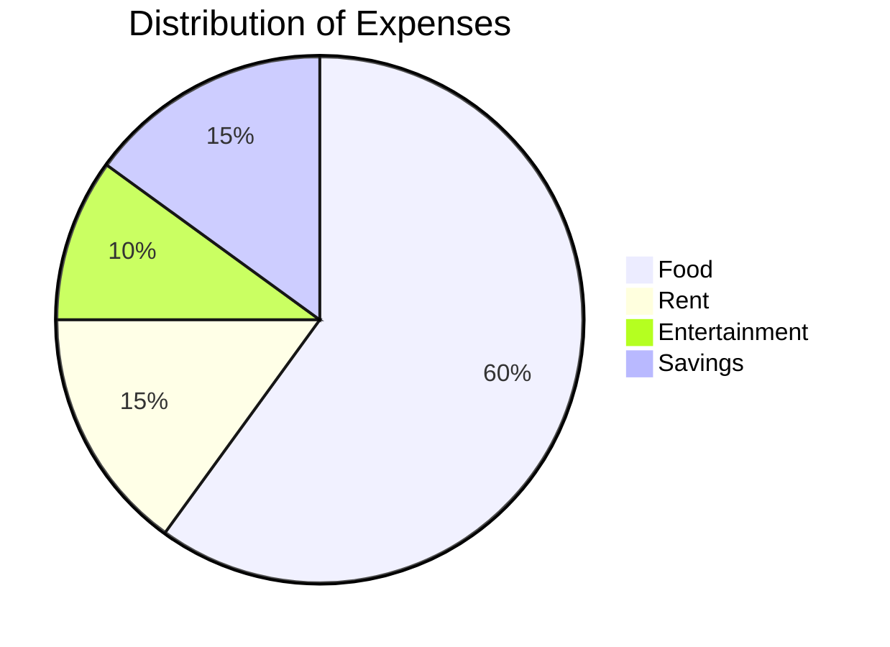

# Seven System

```mermaid
flowchart TD
    A[Christmas] -->|Get money| B(Go shopping)
    B --> C{Let me think}
    C -->|One| D[Laptop]
    C -->|Two| E[iPhone]
    C -->|Three| F[fa:fa-car Car]
  ```

# Postgres

```mermaid
flowchart TD;
    A[Start] --> B[Process 1];
    B --> C[Process 2];
    C --> D[End];
```

